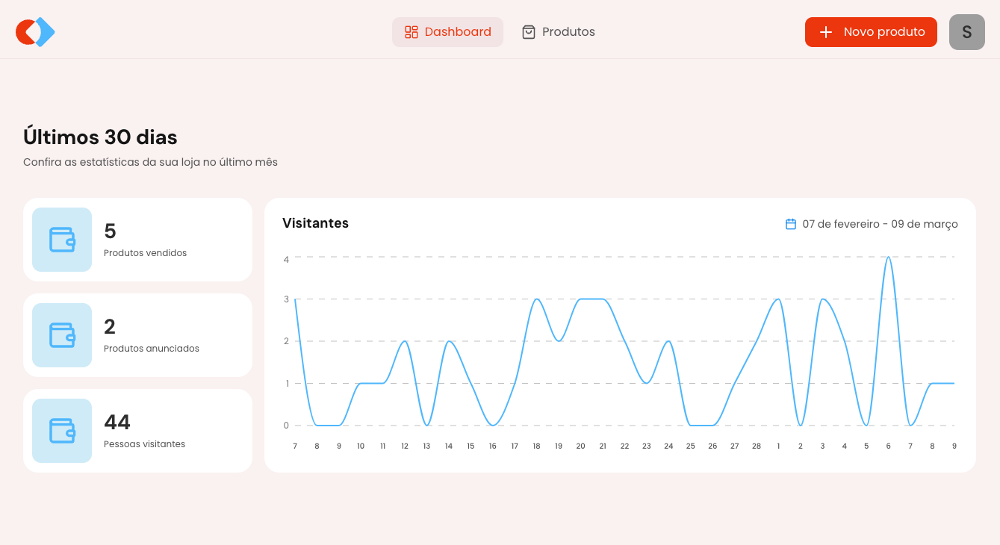
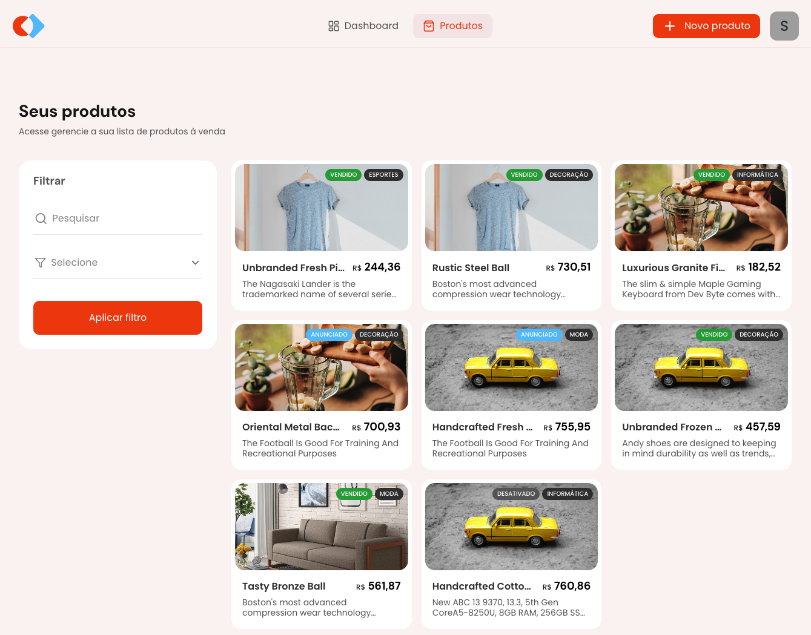
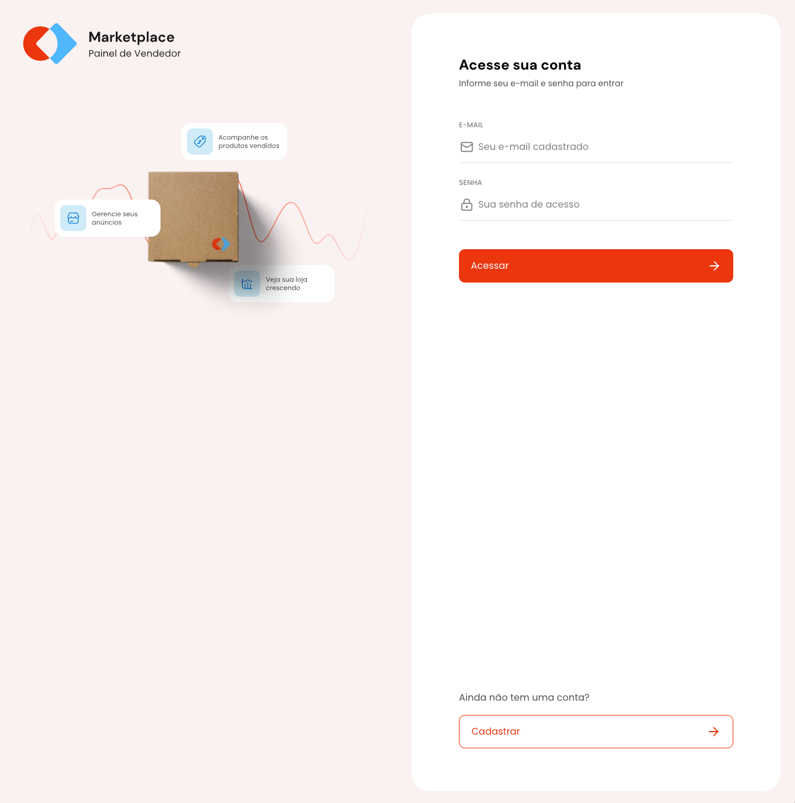

# MBA Marketplace

[](https://opensource.org/licenses/MIT)

O MBA Marketplace é uma plataforma de e-commerce completa para vendedores gerenciarem seus produtos, acompanharem vendas e monitorarem métricas de desempenho. A aplicação fornece um painel intuitivo com análises em tempo real e um sistema otimizado de gerenciamento de produtos.



## Funcionalidades

- **Painel Intuitivo**: Métricas e análises em tempo real para seus produtos
- **Gerenciamento de Produtos**: Crie, atualize e gerencie suas listagens de produtos
- **Acompanhamento de Desempenho**: Monitore visualizações e vendas de produtos ao longo do tempo
- **Autenticação de Usuários**: Login e registro seguros
- **Gerenciamento de Categorias**: Organize produtos por categorias
- **Gerenciamento de Status**: Controle a disponibilidade dos produtos



## Stack Tecnológica

- **Frontend**:

  - React 18
  - TypeScript
  - Vite
  - React Router DOM para roteamento
  - React Hook Form para validação de formulários
  - Zod para validação de esquemas
  - TanStack React Query para busca de dados
  - Tailwind CSS para estilização
  - Recharts para visualização de dados
  - Axios para requisições à API

- **Ferramentas e Utilitários**:
  - ESLint para linting de código
  - Day.js para manipulação de datas
  - Sonner para notificações toast



## Primeiros Passos

### Pré-requisitos

- Node.js (v18 ou superior)
- npm ou yarn

### Instalação

1. Clone o repositório

```bash
git clone https://github.com/felipe-jm/mba-marketplace-frontend.git
cd mba-marketplace-frontend
```

2. Instale as dependências

```bash
npm install
# ou com yarn
yarn install
```

### Desenvolvimento

Inicie o servidor de desenvolvimento:

```bash
npm run dev
# ou com yarn
yarn dev
```

A aplicação estará disponível em http://localhost:5173/

### Compilação para Produção

```bash
npm run build
# ou com yarn
yarn build
```

Para visualizar a compilação de produção:

```bash
npm run preview
# ou com yarn
yarn preview
```

## Estrutura do Projeto

```
src/
├── api/           # Integração com API
├── assets/        # Recursos estáticos
├── components/    # Componentes de UI reutilizáveis
├── lib/           # Bibliotecas utilitárias
├── pages/         # Páginas da aplicação
│   ├── app/       # Dashboard e gerenciamento de produtos
│   ├── auth/      # Páginas de autenticação
│   └── _layouts/  # Componentes de layout
├── utils/         # Funções auxiliares
├── app.tsx        # Componente principal da aplicação
├── routes.tsx     # Definições de rotas
└── main.tsx       # Ponto de entrada da aplicação
```

## Contribuindo

Contribuições são bem-vindas! Sinta-se à vontade para enviar um Pull Request.

## Licença

Este projeto está licenciado sob a Licença MIT - consulte o arquivo LICENSE para obter detalhes.
